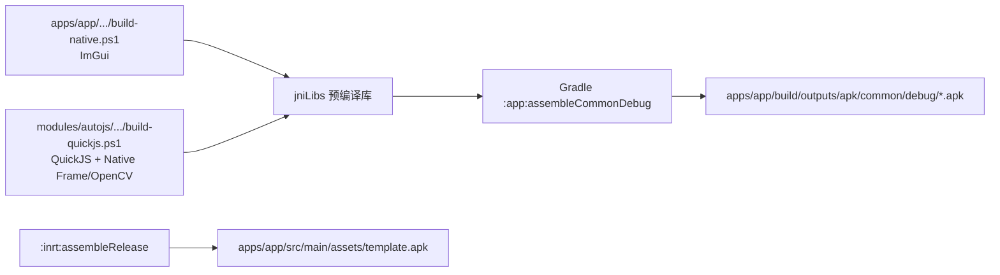

# AI.js Pro 编译指南

> 路径核对日期：2026-09-04。本文中的路径均以仓库根目录为基准。

## 1. 编译流程

本项目采用两段式编译：原生 C/C++ 先由外部 NDK、CMake 和 Ninja 编译为 `.so` 并同步到 `jniLibs`，Gradle 再负责编译 Java/Kotlin 和组装 APK。



| 工具 | 版本 / 位置 |
| --- | --- |
| JDK | JDK 8 最省事；JDK 17 需使用仓库脚本设置兼容参数 |
| Android SDK | 由根目录 `local.properties` 的 `sdk.dir` 指定 |
| NDK | r27c；原生脚本可通过 `-NdkPath` 覆盖默认位置 |
| CMake / Ninja | 可通过 `-CMakePath`、`-NinjaPath` 指定 |
| Gradle Wrapper | 4.10.2 |
| Android Gradle Plugin | 3.2.1 |
| Build Tools | 28.0.3 |
| Kotlin | 1.3.10 |
| Android 配置 | minSdk 21 / targetSdk 28 / compileSdk 28 |

## 2. 编译原生库

### 2.1 ImGui 工作台

```powershell
& '.\apps\app\src\main\cpp\build-native.ps1'
```

产物：

```text
apps/app/src/main/jniLibs/<abi>/libautojs_imgui.so
```

支持 `armeabi-v7a`、`arm64-v8a` 和 `x86`；arm64 使用 16 KiB 最大页对齐。

### 2.2 QuickJS 与 Native Frame

```powershell
& '.\modules\autojs\src\main\cpp\build-quickjs.ps1'
```

脚本从 `modules/autojs/libs/opencv-5.0.0-16kb-page-fix.aar` 提取对应 ABI 的 OpenCV 动态库用于链接，输出：

```text
modules/autojs/src/main/jniLibs/<abi>/libquickjs.so
modules/autojs/src/main/jniLibs/<abi>/libquickjs_jni.so
```

当前 YOLO 统一使用 OpenCV 5.0 DNN，不再单独构建 `libautojs_yolo.so`。

## 3. Gradle 组装

推荐使用根目录统一入口：

```powershell
.\build-common-debug.ps1
.\build-common-debug.ps1 -SkipNative
.\build-common-debug.ps1 -SkipNative -IncludeInrt
```

脚本最终执行：

```powershell
.\gradlew.bat :app:assembleCommonDebug --no-daemon --max-workers=1
```

`--max-workers=1` 用于规避旧版 Gradle/Jetifier 并行转换大体积 OpenCV AAR 时的竞态。也可以直接执行逻辑模块任务：

```powershell
.\gradlew.bat projects --no-daemon --max-workers=1
.\gradlew.bat :app:assembleCommonDebug --no-daemon --max-workers=1
.\gradlew.bat :inrt:assembleDebug --no-daemon --max-workers=1
.\gradlew.bat test --no-daemon --max-workers=1
```

## 4. 输出位置

```text
apps/app/build/outputs/apk/common/debug/
├─ app-common-arm64-v8a-debug.apk
├─ app-common-armeabi-v7a-debug.apk
└─ app-common-x86-debug.apk

apps/inrt/build/outputs/apk/
├─ debug/    inrt-<abi>-debug.apk
└─ release/  inrt-<abi>-release-unsigned.apk

apps/app/src/main/assets/template.apk
```

`:inrt:assembleRelease` 会把 arm64 未签名运行时复制为 `apps/app/src/main/assets/template.apk`。修改 `:inrt` 或其原生依赖后，应重新生成模板。

本地需要保留的 APK、日志和验证截图统一归档到 `.artifacts/`，不纳入 Git；构建缓存可以安全清除。

## 5. JDK 17 兼容

Gradle 4.10.2 与 JDK 17 的模块访问规则不兼容，直接调用 Wrapper 可能出现 `InaccessibleObjectException`。根目录的 `build-common-debug.ps1` 和 `release.ps1` 会为当前进程配置所需的 `--add-opens` / `--add-exports` 参数。

根目录 `local.properties` 示例：

```properties
sdk.dir=C:/Android
```

## 6. 常见问题

| 现象 | 原因 / 处理 |
| --- | --- |
| JDK 17 报模块访问错误 | 使用根目录构建脚本，或切换到 JDK 8 |
| Jetifier 偶发失败 | 使用 `--max-workers=1`，避免同时启动多个 Gradle 构建 |
| 中文路径检查失败 | `gradle.properties` 已设置 `android.overridePathCheck=true` |
| 原生工具找不到 | 给原生脚本传入正确的 NDK、CMake、Ninja 路径 |
| 修改目录后读取旧缓存失败 | 删除 `.gradle/`、各模块 `build/` 和 `.cxx/` 后重建 |
| 脚本 APK 覆盖安装签名冲突 | 模板由 TinySign 重签；安装前卸载旧包或使用相同签名 |

## 7. 脚本 APK 打包

```text
apps/app/src/main/assets/template.apk
  + 用户脚本或项目
  → apps/app/.../autojs/build/ApkBuilder.java
  → 写入 assets/project、修改应用元数据并签名
  → 独立 APK
```

这条链路修改现有 `:inrt` 模板，不是重新生成一套 Android 工程。架构细节见[源码项目说明](../architecture/项目说明.md)。
