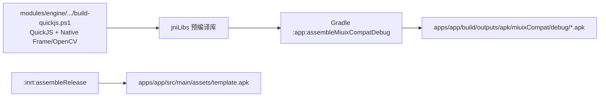

# AI.js Pro 编译指南

> 路径核对日期：2026-09-08。本文中的路径均以仓库根目录为基准。

## 1. 编译流程

本项目采用两段式编译：原生 C/C++ 先由外部 NDK、CMake 和 Ninja 编译为 `.so` 并同步到 `jniLibs`，Gradle 再负责编译 Java/Kotlin 和组装 APK。



| 工具 | 版本 / 位置 |
| --- | --- |
| JDK | JDK 17（Gradle 8.9 + AGP 8.6 原生支持，无需额外参数） |
| Android SDK | 由根目录 `local.properties` 的 `sdk.dir` 指定；需要 platforms;android-35 与 build-tools;34.0.0 |
| NDK | r27c；原生脚本可通过 `-NdkPath` 覆盖默认位置 |
| CMake / Ninja | 可通过 `-CMakePath`、`-NinjaPath` 指定 |
| Gradle Wrapper | 8.9 |
| Android Gradle Plugin | 8.6.1 |
| Build Tools | 34.0.0 |
| Kotlin | 2.1.0 |
| Android 配置 | minSdk 21 / targetSdk 28 / compileSdk 35 |

## 2. 编译原生库

### 2.1 QuickJS 与 Native Frame

```powershell
& '.\modules\engine\src\main\cpp\build-quickjs.ps1'
```

脚本从 `modules/engine/libs/opencv-5.0.0-16kb-page-fix.aar` 提取对应 ABI 的 OpenCV 动态库用于链接，输出：

```text
modules/engine/src/main/jniLibs/<abi>/libquickjs.so
modules/engine/src/main/jniLibs/<abi>/libquickjs_jni.so
modules/engine/src/main/jniLibs/<abi>/libaijscrypto.so
```

其中 `libaijscrypto.so` 是打包脚本解密的原生实现（SHA-256 密钥派生 + AES-256-CBC），
纯 C 实现（不链接 C++ 运行时，三个 ABI 合计 ≈ 45 KB），与 QuickJS 无关但由同一个脚本一起构建。
脚本跑完会把这三个库的修改时间刷成当前时间：Gradle 的 `verifyQuickJsNativeLibrariesFresh`
用时间戳判断「改了原生代码但没重编」，而 ninja 对没受影响的库不会重新链接。

当前 YOLO 统一使用 OpenCV 5.0 DNN，不再单独构建 `libautojs_yolo.so`。

## 3. Gradle 组装

推荐使用根目录统一入口：

```powershell
.\build-miuix-debug.ps1
.\build-miuix-debug.ps1 -SkipNative
.\build-miuix-debug.ps1 -SkipNative -IncludeInrt
.\build-miuix-debug.ps1 -SkipNative -Lite
```

脚本最终执行（默认变体）：

```powershell
.\gradlew.bat :app:assembleMiuixCompatDebug --no-daemon
```

> **2026-09-12 更正**：入口脚本原名为 `build-miuix-debug.ps1`，执行的也是 `:app:assembleCommonDebug`。
> `common` / `coolapk` 两个 channel flavor 已随「UI 统一到 Compose」退役
> （见 [UI 统一迁移方案](../plans/UI_统一到%20Compose(Miuix)%20迁移方案.md) 第 2 节），
> 该任务名已不存在，脚本与本文同步改名/改任务为 Miuix 变体。

也可以直接执行逻辑模块任务：

```powershell
.\gradlew.bat projects --no-daemon
.\gradlew.bat :app:assembleMiuixCompatDebug --no-daemon
.\gradlew.bat :app:assembleMiuixLiteDebug --no-daemon
.\gradlew.bat :inrt:assembleDebug --no-daemon
.\gradlew.bat test --no-daemon
```

> 注：升级到 Gradle 8.9 后已移除 `--max-workers=1`（旧版 Jetifier 并行竞态限制）与 JDK 模块访问 hack。

## 4. 输出位置

```text
apps/app/build/outputs/apk/common/debug/
├─ app-common-arm64-v8a-debug.apk
├─ app-common-armeabi-v7a-debug.apk
└─ app-common-x86-debug.apk

apps/inrt/build/outputs/apk/
├─ debug/    inrt-<abi>-debug.apk
└─ release/  inrt-<abi>-release-unsigned.apk

apps/app/src/main/assets/template.apk
```

`:inrt:assembleRelease` 会把 arm64 未签名运行时复制为 `apps/app/src/main/assets/template.apk`。修改 `:inrt` 或其原生依赖后，应重新生成模板。

本地需要保留的 APK、日志和验证截图统一归档到 `.artifacts/`，不纳入 Git；构建缓存可以安全清除。

## 5. JDK 兼容

Gradle 8.9 与 AGP 8.6 原生支持 JDK 17，根目录的 `build-miuix-debug.ps1` 和 `release.ps1` 无需再配置模块访问参数；JDK 21 亦可用。

根目录 `local.properties` 示例：

```properties
sdk.dir=C:/Android
```

## 6. 常见问题

| 现象 | 原因 / 处理 |
| --- | --- |
| `R.style.Theme_AppCompat_Light` 找不到符号 | 若把 `android.nonTransitiveRClass` / `android.nonFinalResIds` 改回现代默认，需同步迁移模块间资源引用与 `switch (R.id...)` |
| flatDir 警告 | `autojs` 模块通过 flatDir 引入本地 AAR，属预期行为 |
| 中文路径检查失败 | `gradle.properties` 已设置 `android.overridePathCheck=true` |
| 原生工具找不到 | 给原生脚本传入正确的 NDK、CMake、Ninja 路径 |
| 修改目录后读取旧缓存失败 | 删除 `.gradle/`、各模块 `build/` 和 `.cxx/` 后重建 |
| 脚本 APK 覆盖安装签名冲突 | 模板由 TinySign 重签；安装前卸载旧包或使用相同签名 |

## 7. 脚本 APK 打包

```text
apps/app/src/main/assets/template.apk
  + 用户脚本或项目
  → apps/app/.../autojs/build/ApkBuilder.java
  → 写入 assets/project、修改应用元数据并签名
  → 独立 APK
```

这条链路修改现有 `:inrt` 模板，不是重新生成一套 Android 工程。架构细节见[源码项目说明](../architecture/项目说明.md)。
