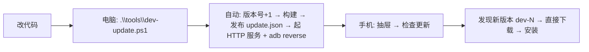

# 自建更新源测试 SOP（改代码 → 手机收到更新）

适用场景：改完一版代码，想通过 app 自己的「检查更新」链路把新版本推到手机上自测。
全程只用自建更新源（`update.json` + 本机 HTTP 服务），不碰 GitHub。

---

## 零、只想快速装机（不测更新链路，最快）

```powershell
# 覆盖安装最近一次构建的包（adb 在本机路径较深，PATH 里没有）
C:\Android\platform-tools\adb.exe install -r apps\app\build\outputs\apk\miuixCompat\debug\app-miuix-compat-arm64-v8a-debug.apk
```

需要先构建过该包；日常"改代码 + 一键构建 + 发布更新源"用下面的 `dev-update.ps1`。

---

## 一、标准流程（3 步）



1. **改代码**（Java / Kotlin / JS / 资源都行；没动 native 就不用重建 QuickJS）
2. **电脑上跑一条命令**：

   ```powershell
   .\tools\dev-update.ps1 -ReleaseNotes "fix: xxx"
   ```

   脚本自动完成：
   - 计算新版本号 = max(**仓库** `project-versions.json`、**上次已发布**的 `update.json`、**手机上已装**的 versionCode) + 1
     → 保证一定比手机上的新（版本号相等是不会提示更新的！）
   - 临时把新版本号写进 `project-versions.json`，构建完**自动还原**（仓库保持干净）
   - 构建 `arm64-v8a` 的 `miuixCompat` debug 包
   - 手机连着 USB 时自动 `adb reverse tcp:8080 tcp:8080`
   - 发布到 `.artifacts/updates/`（写 `update.json`，带 SHA-256）并起 HTTP 服务

   > 服务是**前台阻塞**的：测试期间别关这个终端窗口；测完 `Ctrl+C` 停掉即可。

3. **手机**：打开 AI.js Pro → **抽屉 → 检查更新** → 弹「发现新版本 dev-xxx」→ 直接下载 → 安装
   - 设置页路径同样可用：**设置 → 关于 → 检查更新**
   - 弹窗里除了本次更新说明，还有一行**「更新历史（N 个版本）」**（点一下展开/收起，逐条列出历次版本号 · 日期 · 改动）；发过几版之后这一行才会出现

---

## 一、五、更新历史是怎么来的

| 源 | 数据来源 | 说明 |
|---|---|---|
| 自建源 | `update.json` 的 `oldVersions[].{versionCode, versionName, date, issues}` | `serve-updates.ps1` / `dev-update.ps1` 每次发布都会把「本次版本 + 日期 + 更新说明」追加进同目录的 `update-history.json`（新到旧、按 versionCode 去重、默认 30 条，`-HistoryLimit` 可调）并同步写回 `oldVersions` |
| GitHub 内置源 | 发布列表（`releases?per_page=30`） | 取第一个非草稿/非预发布为「最新版本」，其余比它旧的发布组成历史；日期取 `published_at` 前 10 位 |

> 历史里不会重复显示「正在安装的那个版本」（它就是弹窗上半部的「本次更新」），
> 对应实现：`VersionInfo.historyForDialog()`；界面侧 Miuix 弹窗与旧版 Material 弹窗都已支持。
> 另外 `oldVersions` 里保留着当前已发布版本的条目，所以装完之后再看「检查更新」时，
> 仍能查到当前版本自己的更新说明（Auto.js 的老语义）。

---

## 二、手机上的「检查更新」入口（共 3 个，都会读自建更新源）

| 入口 | 代码路径 | 行为 |
|---|---|---|
| 主界面抽屉「检查更新」 | `DrawerFragment.checkForUpdatesFromDrawer()` → `UpdateCheckDialog` | 进度框 → 有新版本弹「发现新版本」；否则 Toast「已经是最新版本」；失败时带具体原因 |
| 设置页「检查更新」（Miuix / 普通版都有） | `MiuixSettingsActivity` / `SettingsActivity` → `UpdateCheckDialog` | 同上 |
| 启动自动检查（仅 WiFi） | `VersionGuard.checkForDeprecatesAndUpdates()` → `checkForUpdatesIfNeededAndUsingWifi()` | 有新版本时弹「发现新版本」 |

> **2026-09-11 修复**：抽屉入口以前直接调**无参** `checkForUpdates()`——它**永远只查 GitHub，不读「更新源」设置**，配了自建源也不会生效。
> 现在抽屉已统一走 `UpdateCheckDialog`（含错误详情），与设置页完全一致。
> ⚠️ 该修复要**装上新构建的包**才生效——也就是说修好之后第一次仍需手动 `adb install -r` 装一次。

---

## 三、常见问题排查

| 现象 | 原因 | 处理 |
|---|---|---|
| 提示「已经是最新版本」 | 源的 versionCode **不比你手机上的大**（相等不提示） | 用 `dev-update.ps1`（自动 +1）；或手动核对两侧版本号 |
| 提示「检查更新失败：…（自建更新源可在设置里修改）」 | 服务没起 / 地址写错 / 手机连不上电脑 | 看详情里的具体原因；确认终端里服务在跑；`adb reverse` 或改走局域网 IP |
| 下载完装不上 | APK 与手机上的**签名不一致**（app 会自动拦截） | 自测统一用 debug 包（同一台电脑的 debug keystore） |
| 服务在跑，手机却报网络错误 | 更新源填的是 `127.0.0.1`，但没做 `adb reverse`（拔了 USB / 换 WiFi 场景） | 重新插 USB（脚本自动 reverse）；或把更新源改成 `http://<电脑局域网IP>:8080/update.json` |
| GitHub 检查更新常年失败 | 本机网络到 GitHub 不稳 | 用自建源；发布后检查更新不碰 GitHub |

---

## 四、命令速查

```powershell
# 一键：升版本 + 构建 + 发布 + 起服务（阻塞，Ctrl+C 停）
.\tools\dev-update.ps1 -ReleaseNotes "fix: xxx"

# 只重发最近一次构建的包（不重新构建）
.\tools\dev-update.ps1 -SkipBuild

# 指定版本号 / 名字 / ABI / 端口
.\tools\dev-update.ps1 -VersionCode 500 -VersionName "1.0.4-test"
.\tools\dev-update.ps1 -Abi armeabi-v7a
.\tools\dev-update.ps1 -Port 8090

# 只生成 update.json 不起服务（拷贝/scp 到别的机器的场景）
.\tools\dev-update.ps1 -NoServe

# 底层发布器（已有 APK 时直接用）
.\tools\serve-updates.ps1 -Apk <apk路径或通配> -ReleaseNotes "..." -HardLink
```

---

## 五、版本号规则（记住这一条）

> **`update.json` 的 versionCode 必须严格大于手机上已装的 versionCode，才会提示更新。**

- `dev-update.ps1` 已自动处理（含"手机上已装"这个最容易被忽略的基准）
- 手机不认识"版本名字"，只比 versionCode；`dev-467` 这类名字只是显示用
- 安装前提：包名相同 + 签名一致（debug 对 debug）

---

## 六、手动流程（应急，不用脚本）

```powershell
# 1. 改 project-versions.json：appVersionCode +1（appVersionName 随意）
# 2. 构建
. .\tools\jdk17.ps1
.\gradlew.bat :app:assembleMiuixCompatDebug --no-daemon
# 3. 发布（版本号从 APK 自动读取；手机连着的话先 adb reverse）
adb reverse tcp:8080 tcp:8080
.\tools\serve-updates.ps1 -Apk .\apps\app\build\outputs\apk\miuixCompat\debug\*.apk -ReleaseNotes "手动发布" -HardLink
# 4. 手机 → 抽屉 → 检查更新
```

---

## 七、首次使用前的两个前提（一次性）

1. 手机上「设置 → 关于 → 更新源」填：
   - USB 场景：`http://127.0.0.1:8080/update.json`（配合 `adb reverse`）
   - 局域网场景：`http://<电脑IP>:8080/update.json`
2. 手机上装的必须是与构建产物**同签名的包**（本机 debug 包用本机 debug 签名，直接覆盖装）

无更新源地址时，检查更新仍走内置 GitHub Releases（内网/国内容易失败，属预期）。
