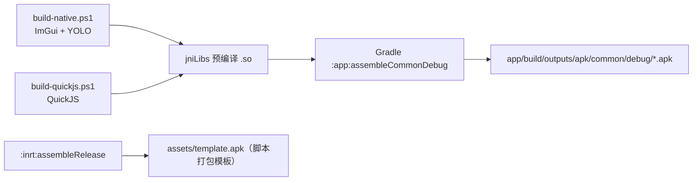

# AI.js Pro 编译指南

> 核对日期：2026-08-30。本文说明如何从本仓库源码编译出可安装的 APK。

## 1. 编译方式总览

本项目采用**两段式编译**：原生 C++ 不进 Gradle，先用外部 NDK + CMake + Ninja 编成 `.so`
预编译库放进 `jniLibs`，Gradle 只负责 Java/Kotlin 编译与 APK 组装。



| 工具 | 版本 / 位置 |
| --- | --- |
| JDK | OpenJDK 17（Microsoft build，需 `JAVA_TOOL_OPTIONS` 适配，见 §4） |
| Android SDK | `C:/Android`（`local.properties` 的 `sdk.dir`） |
| NDK | r27c，默认 `D:\VisualStudio\Shared\Android\AndroidNDK\android-ndk-r27c` |
| CMake / Ninja | 默认来自 VS：`D:\VisualStudio\Community\Common7\IDE\CommonExtensions\Microsoft\CMake\...` |
| Gradle Wrapper | 4.10.2 |
| Android Gradle Plugin | 3.2.1 |
| Build Tools | 28.0.3 |
| Kotlin | 1.3.10 |
| 目标配置 | minSdk 21 / targetSdk 28，包名 `org.autojs.autojs`，版本 4.1.1 Alpha2 |

## 2. 第一步：编译原生库（可选 `-SkipNative` 跳过）

### 2.1 ImGui 工作台 + YOLO

```powershell
& 'app/src/main/cpp/build-native.ps1'
```

| 参数 | 默认值 | 说明 |
| --- | --- | --- |
| `-NdkPath` | `D:\VisualStudio\Shared\Android\AndroidNDK\android-ndk-r27c` | NDK 根目录 |
| `-CMakePath` | VS 自带 cmake.exe | CMake 可执行文件 |
| `-NinjaPath` | VS 自带 ninja.exe | Ninja 可执行文件 |
| `-Configuration` | `Release` | `Debug` / `Release` |

- 编译中间目录：`app/.cxx/imgui-r27/<abi>`
- 产物：
  - `app/src/main/jniLibs/<abi>/libautojs_imgui.so`（armeabi-v7a / arm64-v8a / x86）
  - `autojs/src/main/jniLibs/arm64-v8a/libautojs_yolo.so`（**仅 arm64**）
- arm64 产物启用 16 KB 页大小兼容（`ANDROID_SUPPORT_FLEXIBLE_PAGE_SIZES=ON`）

### 2.2 QuickJS 引擎

```powershell
& 'autojs/src/main/cpp/build-quickjs.ps1'
```

- 参数同 2.1；另从 `autojs/libs/opencv-5.0.0-16kb-page-fix.aar` 解出
  `libopencv_java5.so` 作为链接库。
- 编译中间目录：`autojs/.cxx/quickjs-r27/<abi>`
- 产物：`autojs/src/main/jniLibs/<abi>/libquickjs.so`、`libquickjs_jni.so`（3 个 ABI）

## 3. 第二步：Gradle 组装 APK

统一入口：

```powershell
.\build-common-debug.ps1            # 完整构建：原生 + 主应用
.\build-common-debug.ps1 -SkipNative          # 只跑 Gradle（.so 已就绪）
.\build-common-debug.ps1 -SkipNative -IncludeInrt   # 同时构建 inrt 运行时
```

脚本内部做的事：

1. 依次调用两个原生编译脚本（`-SkipNative` 跳过）；
2. 设置 `JAVA_TOOL_OPTIONS`（JDK 17 需要 `--add-opens` 与 `--add-exports=jdk.compiler`）；
3. 执行：

   ```powershell
   .\gradlew.bat :app:assembleCommonDebug [ :inrt:assembleDebug ] --no-daemon --max-workers=1
   ```

   其中 `--max-workers=1` 是必须的：Gradle 4.10.2 在 Jetifier 转换大体积 OpenCV AAR
   时存在并发竞态。

也可以手动只编某个模块：

```powershell
.\gradlew.bat :app:assembleCommonDebug --no-daemon --max-workers=1
.\gradlew.bat :inrt:assembleDebug --no-daemon --max-workers=1
```

## 4. 产物位置

```text
app/build/outputs/apk/common/debug/
├─ app-common-arm64-v8a-debug.apk    主应用（arm64）
├─ app-common-armeabi-v7a-debug.apk  主应用（32 位）
└─ app-common-x86-debug.apk          主应用（x86 模拟器）

inrt/build/outputs/apk/
├─ debug/    inrt-<abi>-debug.apk
└─ release/  inrt-<abi>-release-unsigned.apk   ← 未签名，用作打包模板

app/src/main/assets/template.apk     脚本打包模板
```

`template.apk` 由 `:inrt:assembleRelease` 触发 `buildApkPlugin` 任务自动生成：
把 `inrt-arm64-v8a-release-unsigned.apk` 改名复制进 `app/src/main/assets/`。
**改了 inrt 或原生库后必须重新跑 release 构建，否则打包模板过期。**

## 5. 常见问题

| 现象 | 原因 / 解决 |
| --- | --- |
| JDK 17 下构建报 `module java.base does not open` 等 | 必须带 `JAVA_TOOL_OPTIONS` 的 `--add-opens`/`--add-exports`，直接用 `build-common-debug.ps1` 即可 |
| Jetifier 阶段偶发失败 / 构建不稳定 | 加 `--max-workers=1`，不要并行跑 Gradle |
| 中文路径报 path check 错误 | 已通过 `gradle.properties` 的 `android.overridePathCheck=true` 放开 |
| 原生脚本报工具找不到 | 用 `-NdkPath` / `-CMakePath` / `-NinjaPath` 指定实际位置 |
| x86 模拟器找不到 `libautojs_yolo.so` | YOLO 只编了 arm64，x86 上不要调用 YOLO 相关 API |
| 打包出的脚本 APK 提示签名冲突 | 模板是 unsigned，由 `TinySign` 用调试 key 重签；覆盖安装前先卸载旧包 |
| Android 15+ 设备安装/运行异常 | 使用 arm64 包（16 KB 页对齐），并在支持的设备上验证 |

## 6. 脚本打包（与编译无关的另一条链路）

`template.apk` + 用户脚本 → `app/.../autojs/build/ApkBuilder.java` 解包 → 改写
Manifest / `resources.arsc` / 加密脚本写入 `assets/project/` → `TinySign` 重签名 → 输出独立 APK。
这不是重新编译，只是模板改写，调试方法见 `项目说明.md`。
